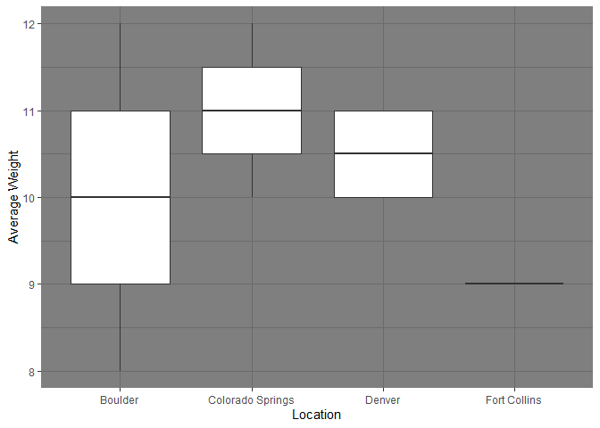
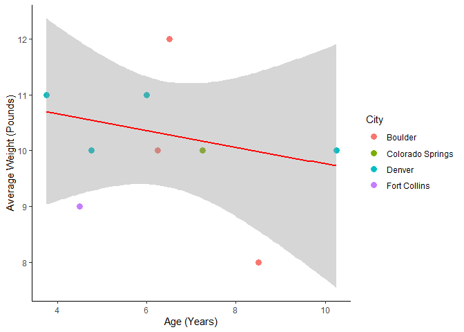
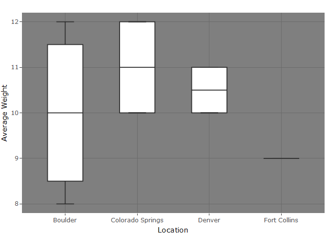
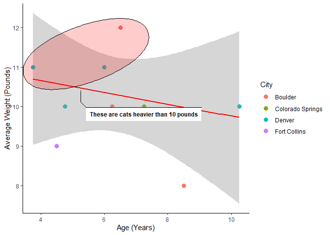
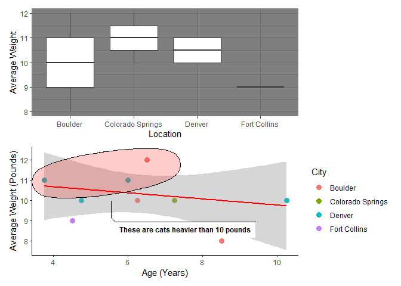
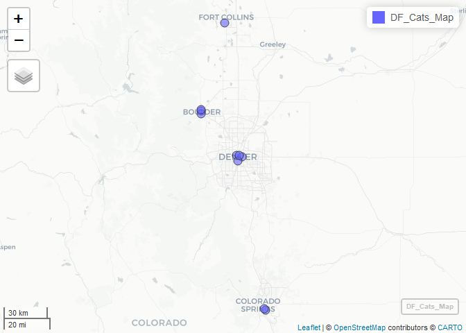

R Walk through on Cleaning, Analyzing, Visualization and Mapping
================
Esteban Arenas
2025-02-11

Objective: This is an introductory R walk through, creating a mock data
set and then going through various ways in which one can clean it,
analyze the data, create some visualizations, and then create maps
visualizations from lat and lon coordinates

We start by creating `DF_Cats`, a mock of what a raw data set might look
like. Below we’ll go through some useful general steps in cleaning,
analyzing and visualizing results using R.

``` r
DF_Cats <- data.frame(
  A = c("Luna","Willow","Name","Miso","Coco","Milo","Bubbles","Socks","Oreo","Fudge", "Muffin",NA, "Muffin"),
  B = c("orange","black","Color","gray","white","gray","brown","brown","black","black","white",NA,"white"),
  C = c(10,9,"Avg. Weight (whole #s)",10,12,10.76,NA,8.1,11,11.876,NA,NA,NA),
  D = c("Denver","Fort Collins","Location","Boulder","Colorado Springs","Denver","Denver","Boulder","Denver","Boulder","Colorado Springs",NA,"Colorado Springs"),
  E = c(4.8,4.5,"Age (round quarter %)",6.3,NA,3.75,10.25,8.5,6,NA,7.25,NA,7.25),
  G = c(NA,NA,NA,NA,NA,NA,NA,NA,NA,NA,NA,NA,NA),
  H = c(TRUE,TRUE,"Indoor",TRUE,TRUE,TRUE,TRUE,TRUE,TRUE,TRUE,TRUE,NA,TRUE),
  I = c("01/14/2025","1/13/2025","Date Surveyed",45636,"12/11/2024","Jan/10/2025","1/6/2025","1/05/2025","08/01/2025","1/8/2025","12/5/2024",NA,"12/5/2024"),
  J = c(39.75115289884762,40.54987369801155,"Lat",40.01748117832861,38.80311438445151,39.74201207575289,39.716228422690236,40.00131035581603,39.74831937335296,40.02695393323672,38.80967904193633,NA,38.80967904193633),
  K = c(-104.99706281032537,-105.0885319787086,"Lon",-105.27776267753427,-104.76783518791748,-104.95473978061132,-104.98374769984966,-105.27534451548036,-104.97590129536343,-105.27441445315193,-104.77443409220167,NA,-104.77443409220167)
)
```

| A | B | C | D | E | G | H | I | J | K |
|:---|:---|:---|:---|:---|:---|:---|:---|:---|:---|
| Luna | orange | 10 | Denver | 4.8 | NA | TRUE | 01/14/2025 | 39.7511528988476 | -104.997062810325 |
| Willow | black | 9 | Fort Collins | 4.5 | NA | TRUE | 1/13/2025 | 40.5498736980116 | -105.088531978709 |
| Name | Color | Avg. Weight (whole \#s) | Location | Age (round quarter %) | NA | Indoor | Date Surveyed | Lat | Lon |
| Miso | gray | 10 | Boulder | 6.3 | NA | TRUE | 45636 | 40.0174811783286 | -105.277762677534 |
| Coco | white | 12 | Colorado Springs | NA | NA | TRUE | 12/11/2024 | 38.8031143844515 | -104.767835187917 |
| Milo | gray | 10.76 | Denver | 3.75 | NA | TRUE | Jan/10/2025 | 39.7420120757529 | -104.954739780611 |
| Bubbles | brown | NA | Denver | 10.25 | NA | TRUE | 1/6/2025 | 39.7162284226902 | -104.98374769985 |
| Socks | brown | 8.1 | Boulder | 8.5 | NA | TRUE | 1/05/2025 | 40.001310355816 | -105.27534451548 |
| Oreo | black | 11 | Denver | 6 | NA | TRUE | 08/01/2025 | 39.748319373353 | -104.975901295363 |
| Fudge | black | 11.876 | Boulder | NA | NA | TRUE | 1/8/2025 | 40.0269539332367 | -105.274414453152 |
| Muffin | white | NA | Colorado Springs | 7.25 | NA | TRUE | 12/5/2024 | 38.8096790419363 | -104.774434092202 |
| NA | NA | NA | NA | NA | NA | NA | NA | NA | NA |
| Muffin | white | NA | Colorado Springs | 7.25 | NA | TRUE | 12/5/2024 | 38.8096790419363 | -104.774434092202 |

## Cleaning a data frame using the janitor package

### Assign column names if stored in a row

Notice that `DF_Cats` has the column names stored in the third row.
`row_to_names()` can make the specified row become the names of the
columns.

``` r
#library(dplyr) - Needed for piping ( %>% ) operations
#library(janitor)

DF_Cats = DF_Cats %>% row_to_names(row_number=3, remove_row = TRUE, remove_rows_above = FALSE)

#Here row_to_names() used the specified row number 3 to assign names to the columns. The third row was afterwards removed (default) and the rows above (rows one and two) were not removed.
```

|  | Name | Color | Avg. Weight (whole \#s) | Location | Age (round quarter %) | NA | Indoor | Date Surveyed | Lat | Lon |
|:---|:---|:---|:---|:---|:---|:---|:---|:---|:---|:---|
| 1 | Luna | orange | 10 | Denver | 4.8 | NA | TRUE | 01/14/2025 | 39.7511528988476 | -104.997062810325 |
| 2 | Willow | black | 9 | Fort Collins | 4.5 | NA | TRUE | 1/13/2025 | 40.5498736980116 | -105.088531978709 |
| 4 | Miso | gray | 10 | Boulder | 6.3 | NA | TRUE | 45636 | 40.0174811783286 | -105.277762677534 |
| 5 | Coco | white | 12 | Colorado Springs | NA | NA | TRUE | 12/11/2024 | 38.8031143844515 | -104.767835187917 |
| 6 | Milo | gray | 10.76 | Denver | 3.75 | NA | TRUE | Jan/10/2025 | 39.7420120757529 | -104.954739780611 |
| 7 | Bubbles | brown | NA | Denver | 10.25 | NA | TRUE | 1/6/2025 | 39.7162284226902 | -104.98374769985 |
| 8 | Socks | brown | 8.1 | Boulder | 8.5 | NA | TRUE | 1/05/2025 | 40.001310355816 | -105.27534451548 |
| 9 | Oreo | black | 11 | Denver | 6 | NA | TRUE | 08/01/2025 | 39.748319373353 | -104.975901295363 |
| 10 | Fudge | black | 11.876 | Boulder | NA | NA | TRUE | 1/8/2025 | 40.0269539332367 | -105.274414453152 |
| 11 | Muffin | white | NA | Colorado Springs | 7.25 | NA | TRUE | 12/5/2024 | 38.8096790419363 | -104.774434092202 |
| 12 | NA | NA | NA | NA | NA | NA | NA | NA | NA | NA |
| 13 | Muffin | white | NA | Colorado Springs | 7.25 | NA | TRUE | 12/5/2024 | 38.8096790419363 | -104.774434092202 |

### Clean column names

Now we can use `clean_names()` to change column names to something
that’s easy to process by code

``` r
DF_Cats = DF_Cats %>% clean_names()

#Notice how parenthesis and blank spaces are converted to _ . % are replaced with percent. # are replaced with number and all letters are now in lower case.
```

|  | name | color | avg_weight_whole_number_s | location | age_round_quarter_percent | na | indoor | date_surveyed | lat | lon |
|:---|:---|:---|:---|:---|:---|:---|:---|:---|:---|:---|
| 1 | Luna | orange | 10 | Denver | 4.8 | NA | TRUE | 01/14/2025 | 39.7511528988476 | -104.997062810325 |
| 2 | Willow | black | 9 | Fort Collins | 4.5 | NA | TRUE | 1/13/2025 | 40.5498736980116 | -105.088531978709 |
| 4 | Miso | gray | 10 | Boulder | 6.3 | NA | TRUE | 45636 | 40.0174811783286 | -105.277762677534 |
| 5 | Coco | white | 12 | Colorado Springs | NA | NA | TRUE | 12/11/2024 | 38.8031143844515 | -104.767835187917 |
| 6 | Milo | gray | 10.76 | Denver | 3.75 | NA | TRUE | Jan/10/2025 | 39.7420120757529 | -104.954739780611 |
| 7 | Bubbles | brown | NA | Denver | 10.25 | NA | TRUE | 1/6/2025 | 39.7162284226902 | -104.98374769985 |
| 8 | Socks | brown | 8.1 | Boulder | 8.5 | NA | TRUE | 1/05/2025 | 40.001310355816 | -105.27534451548 |
| 9 | Oreo | black | 11 | Denver | 6 | NA | TRUE | 08/01/2025 | 39.748319373353 | -104.975901295363 |
| 10 | Fudge | black | 11.876 | Boulder | NA | NA | TRUE | 1/8/2025 | 40.0269539332367 | -105.274414453152 |
| 11 | Muffin | white | NA | Colorado Springs | 7.25 | NA | TRUE | 12/5/2024 | 38.8096790419363 | -104.774434092202 |
| 12 | NA | NA | NA | NA | NA | NA | NA | NA | NA | NA |
| 13 | Muffin | white | NA | Colorado Springs | 7.25 | NA | TRUE | 12/5/2024 | 38.8096790419363 | -104.774434092202 |

### Remove empty rows, columns, and constants

We use `remove_empty()` to get ride of empty rows and columns (default)
and `remove_constant()` to get rid of columns with constant values.

``` r
DF_Cats = DF_Cats %>%
  remove_empty() %>% #removes both rows and columns that are empty
  remove_constant() #drops columns with a single constant value

#We had a column and a row with all NA values that were removed. Our "Indoor" column was also removed, given that all values were TRUE and it didn't add information.
```

|  | name | color | avg_weight_whole_number_s | location | age_round_quarter_percent | date_surveyed | lat | lon |
|:---|:---|:---|:---|:---|:---|:---|:---|:---|
| 1 | Luna | orange | 10 | Denver | 4.8 | 01/14/2025 | 39.7511528988476 | -104.997062810325 |
| 2 | Willow | black | 9 | Fort Collins | 4.5 | 1/13/2025 | 40.5498736980116 | -105.088531978709 |
| 4 | Miso | gray | 10 | Boulder | 6.3 | 45636 | 40.0174811783286 | -105.277762677534 |
| 5 | Coco | white | 12 | Colorado Springs | NA | 12/11/2024 | 38.8031143844515 | -104.767835187917 |
| 6 | Milo | gray | 10.76 | Denver | 3.75 | Jan/10/2025 | 39.7420120757529 | -104.954739780611 |
| 7 | Bubbles | brown | NA | Denver | 10.25 | 1/6/2025 | 39.7162284226902 | -104.98374769985 |
| 8 | Socks | brown | 8.1 | Boulder | 8.5 | 1/05/2025 | 40.001310355816 | -105.27534451548 |
| 9 | Oreo | black | 11 | Denver | 6 | 08/01/2025 | 39.748319373353 | -104.975901295363 |
| 10 | Fudge | black | 11.876 | Boulder | NA | 1/8/2025 | 40.0269539332367 | -105.274414453152 |
| 11 | Muffin | white | NA | Colorado Springs | 7.25 | 12/5/2024 | 38.8096790419363 | -104.774434092202 |
| 13 | Muffin | white | NA | Colorado Springs | 7.25 | 12/5/2024 | 38.8096790419363 | -104.774434092202 |

### Examining duplicate entries

With `get_dupes()` you specify the variable combination to search for
duplicates and it returns the duplicated rows along with a count of the
number of rows sharing that combination of duplicated values.

``` r
DF_Cats %>% get_dupes() #examining duplicates
```

    ##     name color avg_weight_whole_number_s         location
    ## 1 Muffin white                      <NA> Colorado Springs
    ## 2 Muffin white                      <NA> Colorado Springs
    ##   age_round_quarter_percent date_surveyed              lat               lon
    ## 1                      7.25     12/5/2024 38.8096790419363 -104.774434092202
    ## 2                      7.25     12/5/2024 38.8096790419363 -104.774434092202
    ##   dupe_count
    ## 1          2
    ## 2          2

``` r
DF_Cats = DF_Cats[-11,] #removing duplicate row
#In this case we examine the last row with "Muffin" as the name and decide it's a duplicate entry due perhaps to input error. It is therefore removed.
```

|  | name | color | avg_weight_whole_number_s | location | age_round_quarter_percent | date_surveyed | lat | lon |
|:---|:---|:---|:---|:---|:---|:---|:---|:---|
| 1 | Luna | orange | 10 | Denver | 4.8 | 01/14/2025 | 39.7511528988476 | -104.997062810325 |
| 2 | Willow | black | 9 | Fort Collins | 4.5 | 1/13/2025 | 40.5498736980116 | -105.088531978709 |
| 4 | Miso | gray | 10 | Boulder | 6.3 | 45636 | 40.0174811783286 | -105.277762677534 |
| 5 | Coco | white | 12 | Colorado Springs | NA | 12/11/2024 | 38.8031143844515 | -104.767835187917 |
| 6 | Milo | gray | 10.76 | Denver | 3.75 | Jan/10/2025 | 39.7420120757529 | -104.954739780611 |
| 7 | Bubbles | brown | NA | Denver | 10.25 | 1/6/2025 | 39.7162284226902 | -104.98374769985 |
| 8 | Socks | brown | 8.1 | Boulder | 8.5 | 1/05/2025 | 40.001310355816 | -105.27534451548 |
| 9 | Oreo | black | 11 | Denver | 6 | 08/01/2025 | 39.748319373353 | -104.975901295363 |
| 10 | Fudge | black | 11.876 | Boulder | NA | 1/8/2025 | 40.0269539332367 | -105.274414453152 |
| 11 | Muffin | white | NA | Colorado Springs | 7.25 | 12/5/2024 | 38.8096790419363 | -104.774434092202 |

### Homogenizing dates

Dates can be tricky, coming in many different formats. In our
`date_surveyed` column we notice dates in several formats. Some months
are represented with a single digit, others with two, and others with
letters (01 vs. 1 vs. Jan). When importing from excel we might also
receive dates in a numeric encoding system such as 45636. And finally,
one of our entries is in what seems to be day/month/year format
(08/01/2025) instead of month/day/year. This format is common practice
in other countries and is good to check for when working with multiple
data sets or when evaluating entry errors.

1.  First we’ll change the numeric value **(45636)** to a Date format
    using `convert_to_date()` from the **janitor** package.
    `convert_to_date()` recognizes Excel date and numeric formats of
    *character* or *text* classes and converts them to a *Date* class.

2.  Second we’ll use the `mdy()` and `dmy()` functions from the
    **lubridate** package to change **month/day/year** and
    **day/month/year** entries to a *Date* class.

``` r
# library(lubridate)

DF_Cats$date_surveyed_ = as.Date("")
#Create a new column in Date format to populate with our transformed Dates

DF_Cats$date_surveyed_[3] = convert_to_date(DF_Cats$date_surveyed[3])
#converting our numeric entry (45636) to a date class

DF_Cats$date_surveyed_[8] = dmy(DF_Cats$date_surveyed[8])
#converting our day/month/year entry to a date class

DF_Cats$date_surveyed_[-c(3,8)] = mdy(DF_Cats$date_surveyed[-c(3,8)])
#converting the rest of the month/day/year entries to Date format

DF_Cats = DF_Cats[,-6]
#Removing our original raw dates column
```

|  | name | color | avg_weight_whole_number_s | location | age_round_quarter_percent | lat | lon | date_surveyed\_ |
|:---|:---|:---|:---|:---|:---|:---|:---|:---|
| 1 | Luna | orange | 10 | Denver | 4.8 | 39.7511528988476 | -104.997062810325 | 2025-01-14 |
| 2 | Willow | black | 9 | Fort Collins | 4.5 | 40.5498736980116 | -105.088531978709 | 2025-01-13 |
| 4 | Miso | gray | 10 | Boulder | 6.3 | 40.0174811783286 | -105.277762677534 | 2024-12-10 |
| 5 | Coco | white | 12 | Colorado Springs | NA | 38.8031143844515 | -104.767835187917 | 2024-12-11 |
| 6 | Milo | gray | 10.76 | Denver | 3.75 | 39.7420120757529 | -104.954739780611 | 2025-01-10 |
| 7 | Bubbles | brown | NA | Denver | 10.25 | 39.7162284226902 | -104.98374769985 | 2025-01-06 |
| 8 | Socks | brown | 8.1 | Boulder | 8.5 | 40.001310355816 | -105.27534451548 | 2025-01-05 |
| 9 | Oreo | black | 11 | Denver | 6 | 39.748319373353 | -104.975901295363 | 2025-01-08 |
| 10 | Fudge | black | 11.876 | Boulder | NA | 40.0269539332367 | -105.274414453152 | 2025-01-08 |
| 11 | Muffin | white | NA | Colorado Springs | 7.25 | 38.8096790419363 | -104.774434092202 | 2024-12-05 |

### Rounding values

In our `avg_weight_whole_number_s` column we notice that our values are
supposed to be only whole numbers, but not all of them are.
`round_half_up()` from **janitor** will round all our values up to the
nearest whole number. Compare this to `round()`, in which R by default
uses “banker’s rounding” to round halves to the nearest even number.

Our other column `age_round_quarter_percent` takes age data, but only
values of quarters. `round_to_fraction()` will round the values to the
nearest specified denominator.

``` r
#Rounding comparison example below

#values from .5 to 4.5, increasing by 1, are rounded by R default
round(seq(0.5, 4.5, 1))
```

    ## [1] 0 2 2 4 4

``` r
#values rounded by round_half_up() from janitor
round_half_up(seq(0.5, 4.5, 1))
```

    ## [1] 1 2 3 4 5

``` r
DF_Cats$avg_weight_whole_number_s = round_half_up(as.numeric(DF_Cats$avg_weight_whole_number_s))
#as.numeric() is needed because our column "avg_weight_whole_number_s" is currently of class character, given that it has NA values. 

DF_Cats$age_round_quarter_percent = round_to_fraction(as.numeric(DF_Cats$age_round_quarter_percent), denominator = 4)
#rounding all age values to quarters
```

|  | name | color | avg_weight_whole_number_s | location | age_round_quarter_percent | lat | lon | date_surveyed\_ |
|:---|:---|:---|---:|:---|---:|:---|:---|:---|
| 1 | Luna | orange | 10 | Denver | 4.75 | 39.7511528988476 | -104.997062810325 | 2025-01-14 |
| 2 | Willow | black | 9 | Fort Collins | 4.50 | 40.5498736980116 | -105.088531978709 | 2025-01-13 |
| 4 | Miso | gray | 10 | Boulder | 6.25 | 40.0174811783286 | -105.277762677534 | 2024-12-10 |
| 5 | Coco | white | 12 | Colorado Springs | NA | 38.8031143844515 | -104.767835187917 | 2024-12-11 |
| 6 | Milo | gray | 11 | Denver | 3.75 | 39.7420120757529 | -104.954739780611 | 2025-01-10 |
| 7 | Bubbles | brown | NA | Denver | 10.25 | 39.7162284226902 | -104.98374769985 | 2025-01-06 |
| 8 | Socks | brown | 8 | Boulder | 8.50 | 40.001310355816 | -105.27534451548 | 2025-01-05 |
| 9 | Oreo | black | 11 | Denver | 6.00 | 39.748319373353 | -104.975901295363 | 2025-01-08 |
| 10 | Fudge | black | 12 | Boulder | NA | 40.0269539332367 | -105.274414453152 | 2025-01-08 |
| 11 | Muffin | white | NA | Colorado Springs | 7.25 | 38.8096790419363 | -104.774434092202 | 2024-12-05 |

### Filling in missing values

Is this something that we want to do? Or should lines with missing
values be removed? In this example we’ll fill in the missing values, but
will provide code for how to delete those entries, if that were
preferred. We’ll be working with the columns `age_round_quarter_percent`
and `avg_weight_whole_number_s`.

Let’s say we determine that both columns are more or less normally
distributed through the shapiro test. And so we decide to fill in NA
values with the mean.

``` r
shapiro.test(DF_Cats$age_round_quarter_percent) #p values are > .05
```

    ## 
    ##  Shapiro-Wilk normality test
    ## 
    ## data:  DF_Cats$age_round_quarter_percent
    ## W = 0.95313, p-value = 0.7427

``` r
shapiro.test(DF_Cats$avg_weight_whole_number_s)
```

    ## 
    ##  Shapiro-Wilk normality test
    ## 
    ## data:  DF_Cats$avg_weight_whole_number_s
    ## W = 0.93444, p-value = 0.5573

``` r
#Replacing NA values in "age_round_quarter_percent" with the mean of the column, using round_to_fraction() to round mean to the nearest quarter.
DF_Cats$age_round_quarter_percent = ifelse(is.na(DF_Cats$age_round_quarter_percent), 
                      round_to_fraction(mean(DF_Cats$age_round_quarter_percent,
                             na.rm = TRUE), denominator = 4),
                      DF_Cats$age_round_quarter_percent)

#Replacing NA values in "avg_weight_whole_number_s" with the mean of the column, using round_half_up() to get rounded up whole numbers.
DF_Cats$avg_weight_whole_number_s = ifelse(is.na(DF_Cats$avg_weight_whole_number_s), 
                      round_half_up(mean(DF_Cats$avg_weight_whole_number_s,
                             na.rm = TRUE)),
                      DF_Cats$avg_weight_whole_number_s)
```

|  | name | color | avg_weight_whole_number_s | location | age_round_quarter_percent | lat | lon | date_surveyed\_ |
|:---|:---|:---|---:|:---|---:|:---|:---|:---|
| 1 | Luna | orange | 10 | Denver | 4.75 | 39.7511528988476 | -104.997062810325 | 2025-01-14 |
| 2 | Willow | black | 9 | Fort Collins | 4.50 | 40.5498736980116 | -105.088531978709 | 2025-01-13 |
| 4 | Miso | gray | 10 | Boulder | 6.25 | 40.0174811783286 | -105.277762677534 | 2024-12-10 |
| 5 | Coco | white | 12 | Colorado Springs | 6.50 | 38.8031143844515 | -104.767835187917 | 2024-12-11 |
| 6 | Milo | gray | 11 | Denver | 3.75 | 39.7420120757529 | -104.954739780611 | 2025-01-10 |
| 7 | Bubbles | brown | 10 | Denver | 10.25 | 39.7162284226902 | -104.98374769985 | 2025-01-06 |
| 8 | Socks | brown | 8 | Boulder | 8.50 | 40.001310355816 | -105.27534451548 | 2025-01-05 |
| 9 | Oreo | black | 11 | Denver | 6.00 | 39.748319373353 | -104.975901295363 | 2025-01-08 |
| 10 | Fudge | black | 12 | Boulder | 6.50 | 40.0269539332367 | -105.274414453152 | 2025-01-08 |
| 11 | Muffin | white | 10 | Colorado Springs | 7.25 | 38.8096790419363 | -104.774434092202 | 2024-12-05 |

If you want to remove the NA values, `drop_na()` from the **tidyverse**
package is a simple option to remove all rows with NA values in the
specified columns.

``` r
#library(tidyr)

#if no columns are specified, rows with NA values in any column will be removed.
DF_Cats %>% drop_na()
```

    ##       name  color avg_weight_whole_number_s         location
    ## 1     Luna orange                        10           Denver
    ## 2   Willow  black                         9     Fort Collins
    ## 3     Miso   gray                        10          Boulder
    ## 4     Coco  white                        12 Colorado Springs
    ## 5     Milo   gray                        11           Denver
    ## 6  Bubbles  brown                        10           Denver
    ## 7    Socks  brown                         8          Boulder
    ## 8     Oreo  black                        11           Denver
    ## 9    Fudge  black                        12          Boulder
    ## 10  Muffin  white                        10 Colorado Springs
    ##    age_round_quarter_percent              lat               lon date_surveyed_
    ## 1                       4.75 39.7511528988476 -104.997062810325     2025-01-14
    ## 2                       4.50 40.5498736980116 -105.088531978709     2025-01-13
    ## 3                       6.25 40.0174811783286 -105.277762677534     2024-12-10
    ## 4                       6.50 38.8031143844515 -104.767835187917     2024-12-11
    ## 5                       3.75 39.7420120757529 -104.954739780611     2025-01-10
    ## 6                      10.25 39.7162284226902  -104.98374769985     2025-01-06
    ## 7                       8.50  40.001310355816  -105.27534451548     2025-01-05
    ## 8                       6.00  39.748319373353 -104.975901295363     2025-01-08
    ## 9                       6.50 40.0269539332367 -105.274414453152     2025-01-08
    ## 10                      7.25 38.8096790419363 -104.774434092202     2024-12-05

## Some Analysis and Descriptive Statistics

### Using get_dupes() from Janitor to find similar data entries

Lets say you wanted to see if any cats were surveyed in the same city
and share the same hair color. This might give insights into the data,
potentially suggesting that these cats are related. With `get_dupes()`
you can specify the columns you want to compare, and then get an output
of the rows that share those characteristics along with a count of those
rows.

``` r
#Are Coco and Muffin related? Do they live near each other?
DF_Cats %>% get_dupes(color,location)
```

    ##   color         location dupe_count   name avg_weight_whole_number_s
    ## 1 white Colorado Springs          2   Coco                        12
    ## 2 white Colorado Springs          2 Muffin                        10
    ##   age_round_quarter_percent              lat               lon date_surveyed_
    ## 1                      6.50 38.8031143844515 -104.767835187917     2024-12-11
    ## 2                      7.25 38.8096790419363 -104.774434092202     2024-12-05

### Using tabyl() from Janitor to understand column categories

With `tabyl()` we can easily see how many cats of the different colors
are present in each city. `tabyl()` can compare up to three columns and
results can be styled through \*\*adorn\_\*()\*\* functions.

``` r
DF_Cats %>% tabyl(color,location)
```

    ##   color Boulder Colorado Springs Denver Fort Collins
    ##   black       1                0      1            1
    ##   brown       1                0      1            0
    ##    gray       1                0      1            0
    ##  orange       0                0      1            0
    ##   white       0                2      0            0

``` r
#Compare the above result with the adorned version below
DF_Cats %>% tabyl(color,location) %>% 
  adorn_totals(c("row","col")) %>% #add totals to rows and columns
  adorn_percentages() %>% #calculate percentages
  adorn_pct_formatting(rounding = "half up", digits = 0) %>% #specify number of percent decimals and adds the % symbol
  adorn_ns() %>% #include the total number of entries in parenthesis
  adorn_title("combined") #Add a title for rows, columns or both combined
```

    ##  color/location Boulder Colorado Springs   Denver Fort Collins     Total
    ##           black 33% (1)           0% (0)  33% (1)      33% (1) 100%  (3)
    ##           brown 50% (1)           0% (0)  50% (1)       0% (0) 100%  (2)
    ##            gray 50% (1)           0% (0)  50% (1)       0% (0) 100%  (2)
    ##          orange  0% (0)           0% (0) 100% (1)       0% (0) 100%  (1)
    ##           white  0% (0)         100% (2)   0% (0)       0% (0) 100%  (2)
    ##           Total 30% (3)          20% (2)  40% (4)      10% (1) 100% (10)

### Using summarise() from the dplyr package to get summary statistics

`summarise()` is good to get specified summary statistics from a grouped
variable. In the example below we’ll calculate weight mean, median,
standard deviation, and variance, grouping by location.

``` r
DF_Cats %>%
  group_by(location) %>%
  summarise(n = n(), # Count by location
            mean_weight = mean(avg_weight_whole_number_s, na.rm = TRUE), # Mean
            median_weight = median(avg_weight_whole_number_s, na.rm = TRUE), # Median
            sd_weight = sd(avg_weight_whole_number_s, na.rm = TRUE), # Standard deviation
            var_weight = var(avg_weight_whole_number_s, na.rm = TRUE)) # Variance
```

    ## # A tibble: 4 × 6
    ##   location             n mean_weight median_weight sd_weight var_weight
    ##   <chr>            <int>       <dbl>         <dbl>     <dbl>      <dbl>
    ## 1 Boulder              3        10            10       2          4    
    ## 2 Colorado Springs     2        11            11       1.41       2    
    ## 3 Denver               4        10.5          10.5     0.577      0.333
    ## 4 Fort Collins         1         9             9      NA         NA

### Using skim() from the skimr package to conveniently summarize the entire data set or by grouped variables

The output using `skim()` is slightly different from `summarise()`, but
it’s perhaps a little quicker and uses less code. If no parameters are
passed, `skim()` will summarize the entire data set by variable class.

``` r
# library(skimr)
DF_Cats %>% skim()
```

|                                                  |            |
|:-------------------------------------------------|:-----------|
| Name                                             | Piped data |
| Number of rows                                   | 10         |
| Number of columns                                | 8          |
| \_\_\_\_\_\_\_\_\_\_\_\_\_\_\_\_\_\_\_\_\_\_\_   |            |
| Column type frequency:                           |            |
| character                                        | 5          |
| Date                                             | 1          |
| numeric                                          | 2          |
| \_\_\_\_\_\_\_\_\_\_\_\_\_\_\_\_\_\_\_\_\_\_\_\_ |            |
| Group variables                                  | None       |

Data summary

**Variable type: character**

| skim_variable | n_missing | complete_rate | min | max | empty | n_unique | whitespace |
|:--------------|----------:|--------------:|----:|----:|------:|---------:|-----------:|
| name          |         0 |             1 |   4 |   7 |     0 |       10 |          0 |
| color         |         0 |             1 |   4 |   6 |     0 |        5 |          0 |
| location      |         0 |             1 |   6 |  16 |     0 |        4 |          0 |
| lat           |         0 |             1 |  15 |  16 |     0 |       10 |          0 |
| lon           |         0 |             1 |  16 |  17 |     0 |       10 |          0 |

**Variable type: Date**

| skim_variable | n_missing | complete_rate | min | max | median | n_unique |
|:---|---:|---:|:---|:---|:---|---:|
| date_surveyed\_ | 0 | 1 | 2024-12-05 | 2025-01-14 | 2025-01-07 | 9 |

**Variable type: numeric**

| skim_variable | n_missing | complete_rate | mean | sd | p0 | p25 | p50 | p75 | p100 | hist |
|:---|---:|---:|---:|---:|---:|---:|---:|---:|---:|:---|
| avg_weight_whole_number_s | 0 | 1 | 10.30 | 1.25 | 8.00 | 10.00 | 10.00 | 11.00 | 12.00 | ▂▂▇▃▃ |
| age_round_quarter_percent | 0 | 1 | 6.42 | 1.93 | 3.75 | 5.06 | 6.38 | 7.06 | 10.25 | ▇▅▇▂▂ |

``` r
#Below we use skim() to get summary statistics of age, and weight by color
DF_Cats %>%
  group_by(color) %>%
  select(avg_weight_whole_number_s,age_round_quarter_percent) %>%
  skim()
```

|                                                  |            |
|:-------------------------------------------------|:-----------|
| Name                                             | Piped data |
| Number of rows                                   | 10         |
| Number of columns                                | 3          |
| \_\_\_\_\_\_\_\_\_\_\_\_\_\_\_\_\_\_\_\_\_\_\_   |            |
| Column type frequency:                           |            |
| numeric                                          | 2          |
| \_\_\_\_\_\_\_\_\_\_\_\_\_\_\_\_\_\_\_\_\_\_\_\_ |            |
| Group variables                                  | color      |

Data summary

**Variable type: numeric**

| skim_variable | color | n_missing | complete_rate | mean | sd | p0 | p25 | p50 | p75 | p100 | hist |
|:---|:---|---:|---:|---:|---:|---:|---:|---:|---:|---:|:---|
| avg_weight_whole_number_s | black | 0 | 1 | 10.67 | 1.53 | 9.00 | 10.00 | 11.00 | 11.50 | 12.00 | ▇▁▁▇▇ |
| avg_weight_whole_number_s | brown | 0 | 1 | 9.00 | 1.41 | 8.00 | 8.50 | 9.00 | 9.50 | 10.00 | ▇▁▁▁▇ |
| avg_weight_whole_number_s | gray | 0 | 1 | 10.50 | 0.71 | 10.00 | 10.25 | 10.50 | 10.75 | 11.00 | ▇▁▁▁▇ |
| avg_weight_whole_number_s | orange | 0 | 1 | 10.00 | NA | 10.00 | 10.00 | 10.00 | 10.00 | 10.00 | ▁▁▇▁▁ |
| avg_weight_whole_number_s | white | 0 | 1 | 11.00 | 1.41 | 10.00 | 10.50 | 11.00 | 11.50 | 12.00 | ▇▁▁▁▇ |
| age_round_quarter_percent | black | 0 | 1 | 5.67 | 1.04 | 4.50 | 5.25 | 6.00 | 6.25 | 6.50 | ▇▁▁▇▇ |
| age_round_quarter_percent | brown | 0 | 1 | 9.38 | 1.24 | 8.50 | 8.94 | 9.38 | 9.81 | 10.25 | ▇▁▁▁▇ |
| age_round_quarter_percent | gray | 0 | 1 | 5.00 | 1.77 | 3.75 | 4.38 | 5.00 | 5.62 | 6.25 | ▇▁▁▁▇ |
| age_round_quarter_percent | orange | 0 | 1 | 4.75 | NA | 4.75 | 4.75 | 4.75 | 4.75 | 4.75 | ▁▁▇▁▁ |
| age_round_quarter_percent | white | 0 | 1 | 6.88 | 0.53 | 6.50 | 6.69 | 6.88 | 7.06 | 7.25 | ▇▁▁▁▇ |

## Visualizations using ggplot2

I like using **ggplot2** over base R or other graphics because of how
flexible, consistent, and visually appealing it is. **ggplot2** follows
a consistent underlying grammar of graphics that’s easy to follow. With
some added packages we’ll see below, you can customize visuals even
further and make them interactive.

### Box and Scatter plots using ggplot2

First we create a box plot of average weight by location and assign the
plot the name of “Box_Plot”

``` r
# library(ggplot2)
Box_Plot = ggplot(data = DF_Cats, 
       mapping = aes(x = location, y = avg_weight_whole_number_s)) + 
  labs(x = "Location", 
       y = "Average Weight") + 
  geom_boxplot() +
  theme_dark()

Box_Plot
```

<!-- -->

Second we create a scatter plot of average weight by location and color,
assigning it the name of “Scatter_Plot”

``` r
Scatter_Plot = ggplot(data = DF_Cats, 
       mapping = aes(age_round_quarter_percent, avg_weight_whole_number_s, colour = location)) + 
  geom_point(size = 3) +
  geom_smooth(method = lm, color = "red", se = TRUE) +
  labs(colour = "City",
       x = "Age (Years)",
       y = "Average Weight (Pounds)") +
  theme_classic()

Scatter_Plot
```

<!-- -->

### Using ggplot2 extensions plotly, patchwork, and ggforce to enhance graphs

**plotly** has a lot of great features that make your graphics
interactive. Below we’ll make our box plot interactive.

*Note:* that in a non HTML format, the plot will be static. To view the
interactive html version download this
[file](https://github.com/esteban-arenas/R_Intro_Materials/blob/main/R_Cleaning_Analysis_Visualization.html)
and open it on a browser.

``` r
# library(plotly)
ggplotly(Box_Plot)
```

<!-- -->

**ggforce** enhances scatter plots by allowing you to highlight certain
points, drawing an ellipse around points that adhere to a given filter.
A sign pointing to the ellipse can also be added. Below we will add the
ellipse and sign to our saved “Scatter_Plot” created above.

``` r
# library(ggforce)
Scatter_Plot = Scatter_Plot +
  geom_mark_ellipse(
    data = DF_Cats %>% filter(avg_weight_whole_number_s > 10),
    aes(x0 = 7.5, y0= 9, label = "These are cats heavier than 10 pounds", group = -1L),
    fill = "red", colour = "black", alpha = .2, label.fontsize = 9)

Scatter_Plot
```

<!-- -->

**patchwork** is great for letting you combined multiple plots into one
and be able to visualize or save them as one image.

``` r
# library(patchwork)
Box_Plot / Scatter_Plot
```

<!-- -->

## Mapping data using mapview

If you have latitude and longitude coordinates in your data, you can map
each entry as a point on a map and add whichever label you want.

*Note:* that in a non HTML format, the map will be static. To view the
interactive html version download this
[file](https://github.com/esteban-arenas/R_Intro_Materials/blob/main/R_Cleaning_Analysis_Visualization.html)
and open it on a browser.

``` r
# library(sf)
# library(mapview)
DF_Cats_Map <- st_as_sf(DF_Cats, coords = c("lon", "lat"),  crs = 4326)
#spatial data must first be converted to simple features object in order for it to be read and mapped appropriately
mapview(DF_Cats_Map, map.types ="CartoDB.Positron",label = DF_Cats_Map$name)
```

<!-- -->
